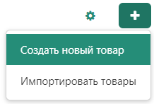
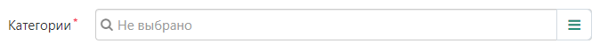
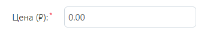

# Добавление товара

## Раздел добавления товаров

Зайди в панель управления маркетплейса под учетной записью продавца.

Перейди в раздел

> [Товары - Товары](https://saint-place.ru/vendor.php?dispatch=products.manage)

## Создание товара

В правом верхнем углу нажми **"+"**, далее нажми **Создать новый товар**.

## Карточка товара

В карточке товара заполни необходимые поля.

> Поля отмеченные * обязательны к заполнению.

### Общее

На вкладке **Общее**, данные разбиты на группы.

#### Информация

##### Название

В поле **Название**, введи наименование товара.

##### Категории

Выбери категорию товара.

Есть два способа выбора категорий.

::: tip Первый способ
В поле выбора категорий, кликни на иконку справа.
 
В открывшемся окне укажи одну или несколько категорий, которым соответствует товар.
 
Нажми **Сохранить**.
:::

::: tip Второй способ
Кликни на поле выбора категорий. 
 
В выпадающем списке выбери одну или несколько категорий, которым соответствует товар.
 
Для быстрого поиска нужной категории, в поле выбора категорий, введи наименования категории.
:::

##### Цена

В поле **Цена** введи цену товара.

##### Подробное описание

В поле **Подробное описание**, укажи описание товара.

##### Статус

Укажи **Статус** товара.

::: tip Вкл.
Товар выставлен на витрину, его можно найти в поиске.
:::

::: tip Выкл.
Товар выставлен на витрину, его можно найти в поиске.
:::

::: tip Скрыто.
Товар не выставлен на витрину, его нельзя найти в поиске, но при этом он доступен по прямой ссылке.
:::

##### Изображения

Нажми кнопку **Выберите изображения**, чтобы загрузить изображения товара.

Первое изображение будет превью товара в списке всех товаров. Минимальные размеры первого изображения 720px на 1080px (ширина / высота).

#### Ценообразование / Склад

##### КОД

В поле **КОД** укажи артикул товара.

##### Рекомендованная цена

В поле **Рекомендованная цена** укажи цену товара без скидки.

::: tip Пример.
В поле **Цена** указано: 20000.
 
В поле **Рекомендованная цена**: 25000.
 
На витрине у товара появится ярлык с размером скидки.
:::

##### В наличии

В поле **В наличии** укажи количество товара в наличии.

::: danger Внимание.
Если вендор работает на тарифе **Со склада Магазина**, поле **В наличии** обязательно для заполнения.
 
Если вендор работает на тарифе **Со склада Маркетплейса**, количество товара обновится автоматически, когда товар будет доставлен на склад **SaintPlace**.
:::

#### Доступность

##### Доступен с

::: warning Информация
Дата, с которой товар можно будет купить. Полезно, если товар ожидает поступления, или если вендор хочет начать продажи в какой-то определённый день.
:::

##### Действие при отсутствии товара в наличии

::: tip Не выбрано.
Покупатель не сможет купить товар, если товара нет в наличии, или если вендор указал дату, начиная с которой товар будет доступен, а эта дата ещё не наступила.
:::

::: tip Предзаказ.
Покупатель сможет купить товар заранее, если вендор указали дату, начиная с которой товар будет доступен, а эта дата ещё не наступила.
:::

::: tip Подписаться на уведомления.
Покупатель сможет подписаться на уведомление о том, что товар появился в наличии; это уведомление придёт по электронной почте.
:::

#### Подробнее

##### Ключевые слова для поиска

#### Создание

В правом верхнем углу нажми **Создать**.

После создания товара, появятся дополнительные разделы, для настройки товара.

Также, после создания товара, появится возможность предпросмотра товара на витрине.

### Подписчики

У каждого товара есть свой список с электронными адресами подписчиков. Этот список находится на вкладке **Подписчики**. Когда товар снова появляется в наличии, электронные письма отправляются подписчикам, а их электронные адреса удаляются из списка.

### Отзывы

На вкладке **Отзывы** можно добавлять или редактировать существующие отзывы покупателей о товаре.

