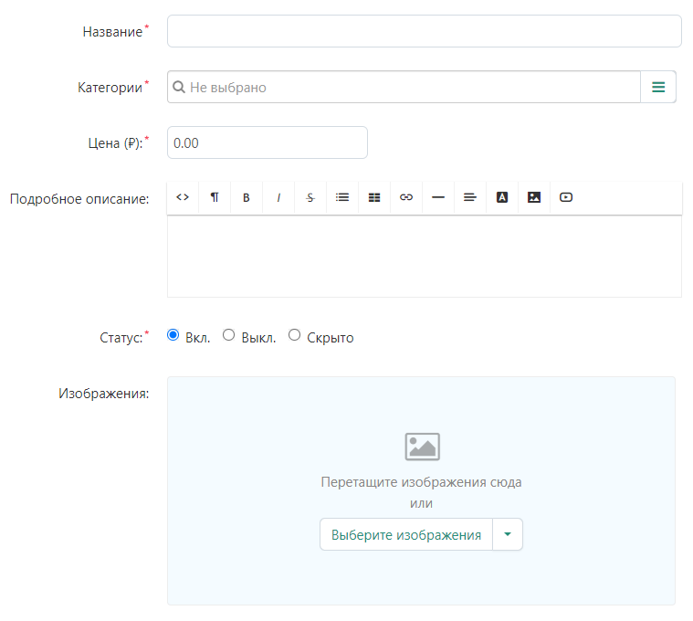

# Добавление товара

## Раздел добавления товаров

Зайди в панель управления маркетплейса под учетной записью продавца.

Перейди в раздел

> [Администрирование - Товары - Товары](https://saint-place.ru/vendor.php?dispatch=products.manage)

## Создание товара

Чтобы создать новый товар, в правом верхнем углу нажми **"+"**, далее **Создать новый товар**.

## Карточка товара

В карточке товара заполни поля необходимые поля.

> Поля помеченные * обязательны к заполнению.

### Общее

На вкладке **Общее**, данные разбиты на группы.

#### Информация

##### Наименование

##### Категории

##### Цена

##### Подробное описание

##### Статус

##### Изображения

#### Ценообразование / Склад

##### КОД

