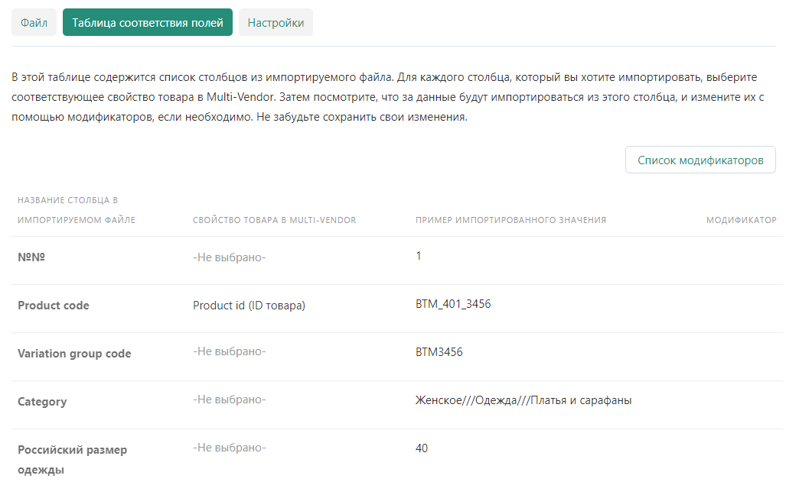

# Импорт товаров

## Файл импорта

Зайди в панель управления маркетплейса под учетной записью продавца.

Перейди в раздел

> [Администрирование - Импорт данных - Товары](https://saint-place.ru/vendor.php?dispatch=import_presets.manage&object_type=products)

### Создание пресета

В верхнем правом углу нажми **"+"**, чтобы создать новый пресет импорта.

### Загрузка файл

Нажми Загрузить файл, в появившемся окне открой созданный **.csv** файл.

### Название пресета

Придумай название для создаваемого пресета.

### Сопоставление полей

Нажми кнопку **Следующий шаг: сопоставьте поля**.

### Таблица сопоставления полей

В таблице сопоставления представлены 3 основных столбца, которые необходимо настроить.

::: tip Название столбца в импортируемом файле
Список столбцов из таблицы загруженного файла.
:::

::: tip Свойства товара в Multi-Vendor
Свойства или характеристики товаров на **SaintPlace**.
:::

::: tip Пример импортированного значения
Первая строка импортированных данных, после наименования столбцов.
:::

Во втором столбце, в поле выбора характеристик, в выпадающем списке, найди характеристики, совпадающие по наименованию, с наименованием из первого столбца.

Сопоставь необходимые поля.

### Настройки

На вкладке **Настройки**, выполни необходимые настройки для импорта.

#### Общие настройки

#### Дополнительные настройки

### Сохранение пресета

Чтобы не выполнять сопоставления полей в **Таблице настроек**, при повторном импорте, необходимо сохранить пресет.

Чтобы сохранить пресет, Нажми **Сохранить**.

### Импорт товаров

Нажми **Импорт**, чтобы импортировать товары из загруженного файла.

### Вопросы

Если нужна помощь при импорте товаров или остались вопросы, нажми кнопку **Связаться с администрацией**.

